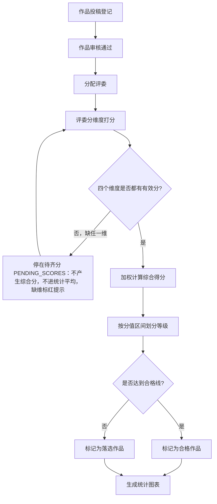

## 1. Product Overview
文创投稿作品综合分值自动分级评审系统是一款面向文创赛事的专业评审工具，支持多位评委对绘画、手作、设计类作品进行多维度独立打分，系统自动加权计算综合得分并划分等级，提供数据分布可视化分析。
- 解决多评委打分效率低、人工计算繁琐、评分标准不统一的问题
- 目标用户：文创赛事组织者、评审专家、参赛者
- 市场价值：提高评审效率，保证评分公平公正，提供数据化决策支持

## 2. Core Features

### 2.1 User Roles
| Role | Registration Method | Core Permissions |
|------|---------------------|------------------|
| 管理员 | 系统后台配置 | 管理作品、评委、权重配置、查看统计 |
| 评委 | 账号分配 | 对作品进行分维度打分 |
| 参赛者 | 注册 | 查看作品状态和评分结果 |

### 2.2 Feature Module
1. **作品管理**：投稿作品基础信息登记、列表查询、状态管理
2. **评委打分**：多评委分维度独立打分录入面板
3. **自动分级**：剔除极端分、加权计算、自动划分等级
4. **统计分析**：等级分布占比图表、数据可视化
5. **系统配置**：打分权重配置、合格线设置

### 2.3 Page Details
| Page Name | Module Name | Feature description |
|-----------|-------------|---------------------|
| 作品列表 | 作品管理 | 展示所有投稿作品，支持品类筛选、状态筛选、搜索 |
| 作品详情 | 作品管理 | 展示作品基础信息、所有评委打分记录、综合得分和等级 |
| 打分面板 | 评委打分 | 评委对作品分维度打分，可只交一个维度；已填维度锁定并显示打分评委，缺维标红；缺任一维作品停在待齐分 |
| 统计分析 | 统计分析 | 仅统计四维齐分作品：各等级作品分布占比图表、不合格作品统计，半成品不计零分不入图 |
| 系统配置 | 系统配置 | 配置各维度打分权重、合格线分值、极端分阈值 |

## 3. Core Process

## 4. User Interface Design
### 4.1 Design Style
- Primary color: #6366f1 (Indigo) - 专业稳重，适合评审场景
- Secondary color: #f59e0b (Amber) - 用于强调等级标识
- Button style: 圆角矩形，hover状态有阴影变化
- Font: Inter (标题) + Noto Sans SC (正文)
- Layout: 卡片式布局，左侧导航，右侧内容区域
- Icon: Lucide icons

### 4.2 Page Design Overview
| Page Name | Module Name | UI Elements |
|-----------|-------------|-------------|
| 作品列表 | 作品管理 | 顶部筛选栏、作品卡片网格、分页组件 |
| 作品详情 | 作品管理 | 基础信息卡片、评委打分表格、综合得分展示、等级徽章 |
| 打分面板 | 评委打分 | 作品信息展示、四个维度评分滑块/输入框、提交按钮 |
| 统计分析 | 统计分析 | 饼图(等级分布)、柱状图(各维度得分分布)、数据汇总卡片 |
| 系统配置 | 系统配置 | 权重配置表单、合格线设置、阈值设置 |

### 4.3 Responsiveness
- Desktop-first (1280px+)
- Tablet adaptation (768px-1280px)
- Mobile basic adaptation (375px-768px)

### 4.4 3D Scene Guidance
Not applicable for this project