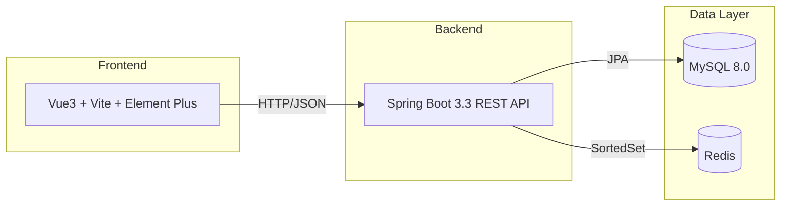
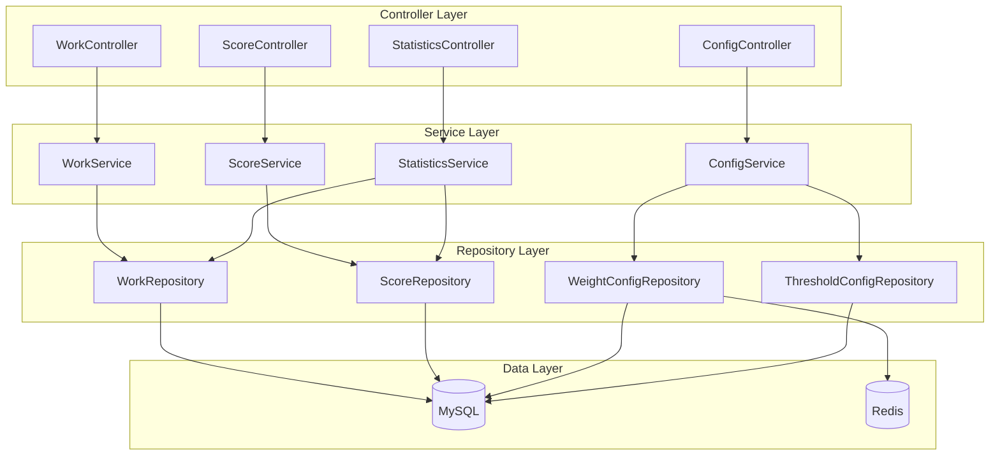
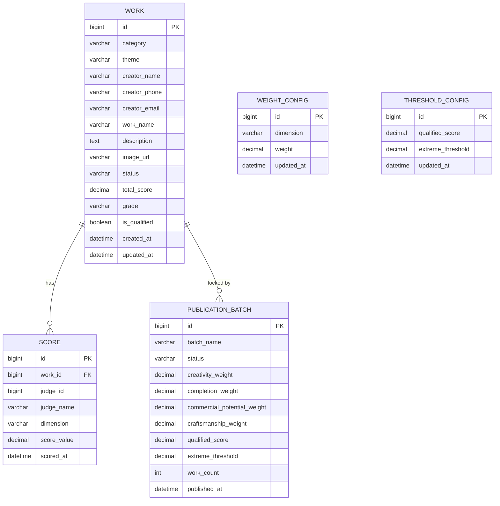

## 1. Architecture Design


## 2. Technology Description
- Frontend: Vue3 + Vite + TypeScript + Element Plus + ECharts + Tailwind CSS
- Backend: Spring Boot 3.3 + JDK 17 + Maven + Spring Data JPA
- Database: MySQL 8.0
- Cache: Redis (SortedSet for weight configuration)
- Containerization: Docker + Docker Compose

## 3. Route Definitions
| Route | Purpose |
|-------|---------|
| / | 首页/作品列表 |
| /works/:id | 作品详情页 |
| /scoring | 评委打分面板 |
| /statistics | 统计分析页 |
| /settings | 系统配置页 |

## 4. API Definitions

### 4.1 作品管理 API
| Method | Endpoint | Purpose |
|--------|----------|---------|
| GET | /api/works | 获取作品列表 |
| GET | /api/works/{id} | 获取作品详情 |
| POST | /api/works | 创建作品 |
| PUT | /api/works/{id} | 更新作品 |
| DELETE | /api/works/{id} | 删除作品 |

### 4.2 评委打分 API
| Method | Endpoint | Purpose |
|--------|----------|---------|
| GET | /api/scores/work/{workId} | 获取作品所有维度分 |
| POST | /api/scores | 提交维度分（body.dimensions 可只带一个或几个维度；撞已填维度整单 409） |
| PUT | /api/scores/{id} | 更新某条维度分的数值 |
| DELETE | /api/scores/{id} | 删除某条维度分（删回缺维则作品退回待齐分、清空综合分） |

### 4.3 统计分析 API
| Method | Endpoint | Purpose |
|--------|----------|---------|
| GET | /api/statistics/grade-distribution | 获取等级分布统计 |
| GET | /api/statistics/dimension-distribution | 获取各维度得分分布 |
| GET | /api/statistics/failed-works | 获取落选作品列表 |

### 4.4 系统配置 API
| Method | Endpoint | Purpose |
|--------|----------|---------|
| GET | /api/config/weights | 获取打分权重配置 |
| PUT | /api/config/weights | 更新打分权重配置（只即时重算未公示作品） |
| GET | /api/config/threshold | 获取合格线和阈值配置 |
| PUT | /api/config/threshold | 更新合格线和阈值配置（只即时重算未公示作品） |

### 4.5 对外公示 API
| Method | Endpoint | Purpose |
|--------|----------|---------|
| POST | /api/publications | 整批公示：body 可带 batchName、workIds（workIds 为空=公示全部已评分未公示作品），单事务按同一配置快照锁定 |
| GET | /api/publications | 公示批次列表（含每批权重/合格线快照） |
| GET | /api/publications/{batchId}/works | 某公示批次内的作品 |
| POST | /api/publications/{batchId}/revoke | 整批撤回（单事务，作品回到未公示并按当前配置恢复即时分） |

## 5. Server Architecture Diagram


## 6. Data Model

### 6.1 Data Model Definition


### 6.2 Data Definition Language

**work表**
```sql
CREATE TABLE work (
    id BIGINT AUTO_INCREMENT PRIMARY KEY,
    category VARCHAR(50) NOT NULL COMMENT '品类：绘画/手作/设计',
    theme VARCHAR(200) COMMENT '创作题材',
    creator_name VARCHAR(100) NOT NULL COMMENT '创作者姓名',
    creator_phone VARCHAR(20) COMMENT '创作者电话',
    creator_email VARCHAR(100) COMMENT '创作者邮箱',
    work_name VARCHAR(200) NOT NULL COMMENT '作品名称',
    description TEXT COMMENT '作品描述',
    image_url VARCHAR(500) COMMENT '作品图片URL',
    status VARCHAR(20) DEFAULT 'PENDING' COMMENT '状态：PENDING/APPROVED/PENDING_SCORES(待齐分)/SCORED/GRADED',
    total_score DECIMAL(5,2) COMMENT '综合得分',
    grade VARCHAR(10) COMMENT '等级：S/A/B/C',
    is_qualified BOOLEAN DEFAULT FALSE COMMENT '是否合格',
    created_at DATETIME DEFAULT CURRENT_TIMESTAMP,
    updated_at DATETIME DEFAULT CURRENT_TIMESTAMP ON UPDATE CURRENT_TIMESTAMP,
    INDEX idx_category (category),
    INDEX idx_status (status),
    INDEX idx_grade (grade)
) ENGINE=InnoDB DEFAULT CHARSET=utf8mb4 COMMENT='投稿作品表';
```

**score表（一条记录 = 某评委对某作品某一维度的一条有效分；同一 work_id+dimension 唯一）**
```sql
CREATE TABLE score (
    id BIGINT AUTO_INCREMENT PRIMARY KEY,
    work_id BIGINT NOT NULL COMMENT '作品ID',
    judge_id BIGINT NOT NULL COMMENT '评委ID',
    judge_name VARCHAR(100) NOT NULL COMMENT '评委姓名',
    dimension VARCHAR(50) NOT NULL COMMENT 'creativity/completion/commercial_potential/craftsmanship',
    score_value DECIMAL(5,2) NOT NULL COMMENT '该维度得分(0-100)；缺维度不是零分，而是没有这一行',
    scored_at DATETIME DEFAULT CURRENT_TIMESTAMP COMMENT '打分时间',
    UNIQUE KEY uk_score_work_dimension (work_id, dimension),
    INDEX idx_work_id (work_id),
    INDEX idx_judge_id (judge_id),
    INDEX idx_dimension (dimension),
    INDEX idx_scored_at (scored_at)
) ENGINE=InnoDB DEFAULT CHARSET=utf8mb4 COMMENT='评委维度分流水（一件作品一个维度一条有效分）';
```

**weight_config表**
```sql
CREATE TABLE weight_config (
    id BIGINT AUTO_INCREMENT PRIMARY KEY,
    dimension VARCHAR(50) NOT NULL COMMENT '维度名称：creativity/completion/commercial_potential/craftsmanship',
    weight DECIMAL(5,2) NOT NULL COMMENT '权重(0-1)',
    updated_at DATETIME DEFAULT CURRENT_TIMESTAMP ON UPDATE CURRENT_TIMESTAMP,
    UNIQUE KEY uk_dimension (dimension)
) ENGINE=InnoDB DEFAULT CHARSET=utf8mb4 COMMENT='打分权重配置表';
```

**threshold_config表**
```sql
CREATE TABLE threshold_config (
    id BIGINT AUTO_INCREMENT PRIMARY KEY,
    qualified_score DECIMAL(5,2) NOT NULL DEFAULT 60 COMMENT '合格线分值',
    extreme_threshold DECIMAL(5,2) NOT NULL DEFAULT 20 COMMENT '极端分阈值(与平均分差值)',
    updated_at DATETIME DEFAULT CURRENT_TIMESTAMP ON UPDATE CURRENT_TIMESTAMP
) ENGINE=InnoDB DEFAULT CHARSET=utf8mb4 COMMENT='阈值配置表';
```

### 6.3 初始数据

**权重配置初始数据**
```sql
INSERT INTO weight_config (dimension, weight) VALUES
('creativity', 0.30),
('completion', 0.25),
('commercial_potential', 0.25),
('craftsmanship', 0.20);
```

**阈值配置初始数据**
```sql
INSERT INTO threshold_config (qualified_score, extreme_threshold) VALUES (60, 20);
```

**等级划分规则**
| 等级 | 分值区间 |
|------|----------|
| S | 90-100 |
| A | 80-89 |
| B | 60-79 |
| C | 0-59 |

## 7. Core Logic

### 7.1 齐分规则（缺维不得进综合分）
1. 一件作品必须在 creativity / completion / commercial_potential / craftsmanship 四个维度各有且仅有一条有效分才算齐分。
2. 缺任何一维：作品停在 `PENDING_SCORES`（待齐分），`total_score / grade` 保持为空，绝不把缺维当 0 分凑综合分。
3. 统计页的等级分布、各维度平均分、落选名单只吃 `status=GRADED`（齐分）作品；半成品任何一维都不进入平均。
4. 同一 `(work_id, dimension)` 有唯一约束；评委提交先对作品行加写锁串行化，撞维整单 409（提示该维已由谁打分），唯一约束为最终兜底。
5. 一次提交的所有维度在单事务内落库（主表 + 按月分表流水同生共死），任何失败整体回滚，不留半截维度。

### 7.2 加权计算综合得分
```
综合得分 = 创意分 × 创意权重 + 完成度分 × 完成度权重 + 
          商业潜力分 × 商业潜力权重 + 工艺分 × 工艺权重
```
每维只有一条有效分，直接取值加权；`GradingService.calculate` 在缺维时返回空结果，由调用方维持待齐分状态。

### 7.3 Redis缓存策略
- 使用Redis SortedSet缓存各维度权重配置
- Key: `score:weights`
- Member: 维度名称
- Score: 权重值
- TTL: 5分钟，配置更新时主动刷新

### 7.4 对外公示快照策略（已公示钉死、未公示随新口径）
- 综合分/等级/合格性只有一套公式（`GradingService`），差异仅在传入口径来源。
- 未公示作品：评委打分提交、保存权重/合格线时，按**当前配置**即时重算（`published=false`）。
- 公示（`PublicationService.publish`，单个 `@Transactional`）：
  1. 先对 `weight_config` / `threshold_config` 行加 `SELECT … FOR UPDATE` 拍同一刻口径快照；
  2. 再对批内 `work` 行加写锁，逐件按快照算分，写 `publication_batch` 与作品的
     `published / publication_batch_id / published_total_score / published_grade / published_is_qualified / published_at`；
  3. 整批同一事务提交。中途断电/失败整体回滚 → 要么整批未公示，要么整批锁完，无半成功。
- 已公示作品：保存配置只重算未公示作品，已公示行不触碰；评委改分（POST/PUT/DELETE scores）在作品行锁内被拒绝（HTTP 409）。
- 并发互斥：打分、保存配置、公示均按"配置行锁→作品行锁"统一顺序加锁，避免交叉死锁。
- 撤回批次（可选运维操作）同样整批单事务回到未公示并按当前配置恢复即时分。

## 8. Docker Configuration

### 8.1 开发环境 docker-compose.dev.yml
```yaml
services:
  mysql:
    image: mysql:8.0
    ports:
      - "127.0.0.1:3388:3306"
    environment:
      MYSQL_ROOT_PASSWORD: root
      MYSQL_DATABASE: review_system
    volumes:
      - mysql_data:/var/lib/mysql

  redis:
    image: redis:7
    ports:
      - "127.0.0.1:6461:6379"
    volumes:
      - redis_data:/data

  backend:
    build: ./backend
    ports:
      - "127.0.0.1:8172:8080"
    environment:
      SPRING_PROFILES_ACTIVE: dev
      DB_HOST: mysql
      DB_PORT: 3306
      DB_NAME: review_system
      DB_USER: root
      DB_PASSWORD: root
      REDIS_HOST: redis
      REDIS_PORT: 6379
    depends_on:
      - mysql
      - redis

  frontend:
    build: ./frontend
    ports:
      - "127.0.0.1:8162:80"
    depends_on:
      - backend

volumes:
  mysql_data:
  redis_data:
```

### 8.2 生产环境 docker-compose.prod.yml
- 使用网易Maven镜像加速后端构建
- 使用中科大npm镜像加速前端构建
- 启用MySQL主从复制(可选)
- 配置Nginx反向代理